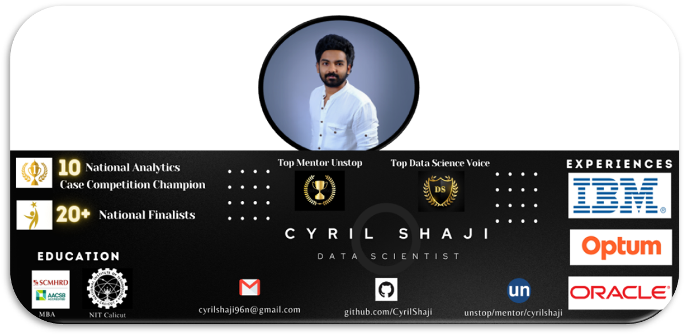
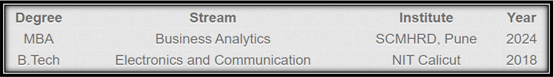

<strong><em>This portfolio highlights my achievements, certifications, and a range of Data Science and Data Analysis projects spanning case competitions, hackathons, academics, and personal interests</em></strong>

<h1 align="center" style="font-size: 40px; color: black; font-weight: bold;">About Me</h1>

- **Email**: [cyrilshaji96n@gmail.com](cyrilshaji96n@gmail.com)
- **LinkedIn**: [linkedin/cyril-shaji](https://www.linkedin.com/in/cyril-shaji-22b933147/)

## Work Experience

**Data Scientist @ IBM (_Present_)**

**Data Science Intern @ Optum(UHG) (_April 2023 - June 2023_)**

**Staff Consultant @ Oracle (_July 2018 - July 2021_)**

       
## Education

  

## Achievements

 
- **_10 Time National Winner in Pan-India Analytics Case Competitions_**
- **_20+ National Finalist Titles in Various B-School Competitions_**
- **_Recognized as a Top Voice in Data Science on LinkedIn_**
- **_In Top 50 Best Student Data Science Champion 2024_**
- **_Completed 50+ Hands-On Analytics and ML Projects_**

&nbsp;

<h1 align="center" style="font-size: 40px; color: black; font-weight: bold;">Projects</h1>

&nbsp;

  

<strong><a href="https://github.com/CyrilShaji/Machine-Learning-Projects/blob/main/E%20Commerce%20Gender%20Prediction.ipynb">**E Commerce Missing Gender Prediction**</a></strong>

In this project, I employ machine learning classification models such as Random Forest, AdaBoost, and LightGBM to predict missing customer genders on an e-commerce platform, aiming to enhance gender-based personalization campaigns and improve click-through rates for fashion-related categories.

&nbsp;

  

<strong><a href="https://github.com/CyrilShaji/Deep-Learning-and-NLP-Projects/blob/main/Disaster%20Tweet%20Prediction%20NLP%20Deep%20Learning.ipynb">**Disaster Tweet Detection Using NLP Deep Learning**</a></strong>

In this project, I utilize BERT and DistilBERT NLP models to develop a deep learning system for Twitter that distinguishes real-time disaster tweets from non-disaster content, serving the needs of disaster relief agencies and news outlets.

&nbsp;

  

<strong><a href="https://app.powerbi.com/groups/me/reports/abd6fdc0-e8c4-4d77-83e9-4027199dea5e/ReportSection?experience=power-bi">**Global Youtube Analytics Dashboard**</a></strong>

In this project, I developed a comprehensive YouTube analytics dashboard using Power BI that provides insights into channel performance categorized by type, trend analysis over time, top channel metrics, and geographical distribution

&nbsp;

&nbsp;

  

<strong><a href="https://github.com/CyrilShaji/Data-Analytics-Projects/blob/main/Composite%20Score%20Statistical%20Analysis%20Mobile%20App%20Performance.ipynb">**Mobile App Performance: Composite Score Model**</a></strong>

In this project, I develop a composite score statistical model that utilizes key indicators such as ratings, reviews, and downloads to quantify the performance of mobile applications. The goal is to precisely identify the top and bottom 100 apps, providing a clear measure of app success in the marketplace.

&nbsp;

## Core Competencies

- **Methodologies**: Statistics, Machine Learning, Deep Learning, Time Series Analysis, Natural Language Processing, Mathematics, A/B Testing , Hypothesis testing and Data Visulaization
- **Languages**: Python (Pandas, Numpy, Scikit-Learn, Scipy, Keras, Tenserflow, Matplotlib), R, SQL, C++
- **Tools**: MySQL, PowerBi, Tableau, Git, SPSS, MS Excel

## Certificates

- [Tableau Essential Training By Linkedin](https://github.com/archd3sai/Portfolio/blob/master/Certificates/CertificateOfCompletion_Tableau%20Essential%20Training%202020.1.pdf)
- [Machine Learning Explainability By Kaggle](https://github.com/archd3sai/Data-Science-Portfolio-Arch-Desai/blob/master/Certificates/Arch%20Desai%20-%20Machine%20Learning%20Explainability.png)
- [Apache PySpark Training By Linkedin](https://github.com/archd3sai/Data-Science-Portfolio-Arch-Desai/blob/master/Certificates/CertificateOfCompletion_Apache%20Pyspark%20By%20Example%20(2).pdf)
- [SQL Essential Training By Linkedin](https://github.com/archd3sai/Data-Science-Portfolio-Arch-Desai/blob/master/Certificates/CertificateOfCompletion_Sql%20Essential%20Training%202018%20(1).pdf)
- [SQL Test By HackerRank](https://www.hackerrank.com/certificates/c0cda4c2f1b5)
- [SQL Test By Testdome](https://www.testdome.com/cert/24cd496af7a24a8489a1fd5de791c392)
- [Data Science Test By Testdome](https://www.testdome.com/cert/124165d7386d4f76be84c240e0547bd3)
- [Deep Learning Specialization By deeplearning.ai](https://github.com/archd3sai/Data-Science-Portfolio-Arch-Desai/blob/master/Certificates/Deep%20Learning%20Specialization.pdf)
    - [Neural Networks and Deep Learning](https://github.com/archd3sai/Data-Science-Portfolio-Arch-Desai/blob/master/Certificates/Neural%20Networks%20and%20Deep%20Learning.pdf)
    - [Structuring Machine Learning Projects](https://github.com/archd3sai/Data-Science-Portfolio-Arch-Desai/blob/master/Certificates/Structuring%20Machine%20Learning%20Projects.pdf)
    - [Improving Deep Neural Networks](https://github.com/archd3sai/Data-Science-Portfolio-Arch-Desai/blob/master/Certificates/Improving%20Deep%20Neural%20Networks.pdf)
    - [Convolution Neural Networks](https://github.com/archd3sai/Data-Science-Portfolio-Arch-Desai/blob/master/Certificates/Convolutional%20Neural%20Networks.pdf)
    - [Sequence Models](https://github.com/archd3sai/Data-Science-Portfolio-Arch-Desai/blob/master/Certificates/Sequence%20Models.pdf)
- [Big Data 101 By Cognitiveclass.ai](https://courses.cognitiveclass.ai/certificates/bfc1df7e5d084a73b84223495263d0fe)
- [Google Analytics for Begineers By Google](https://analytics.google.com/analytics/academy/certificate/kHYtirzEQV29uzNG8xSFXg)
